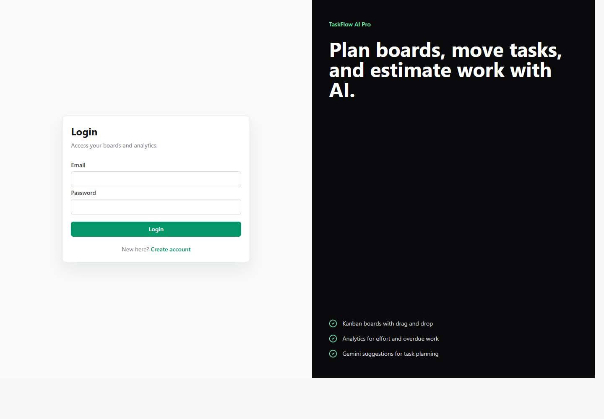
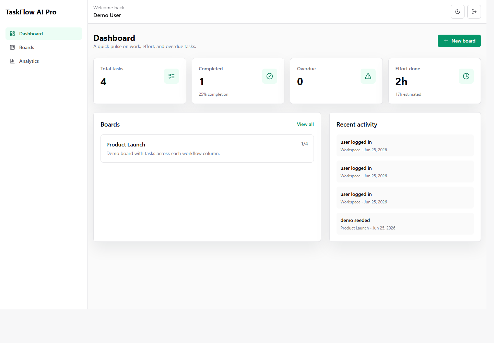
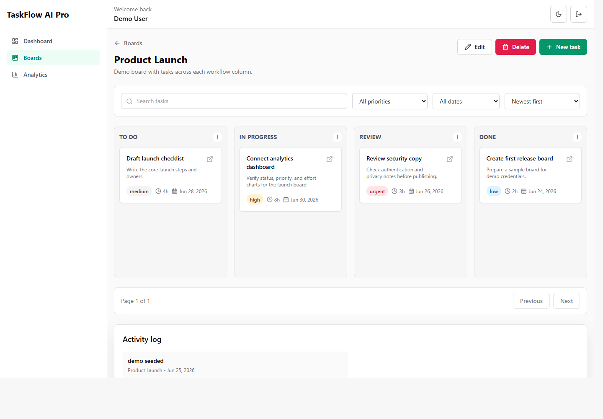
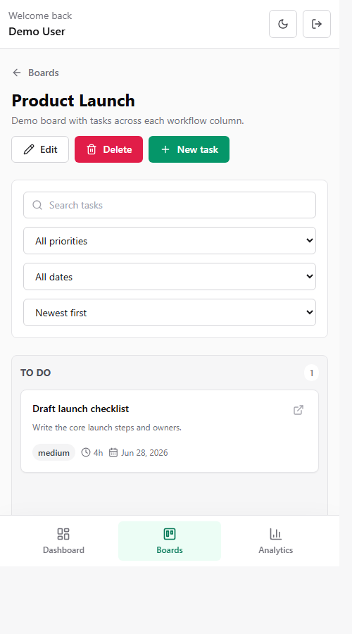

# TaskFlow AI Pro

TaskFlow AI Pro is a full-stack MERN task and project manager with secure authentication, board/task CRUD, drag-and-drop task movement, analytics, activity logging, and a lightweight AI assistant for effort and due-date suggestions.

## Highlights

- React 18 + Vite frontend
- Express + MongoDB backend with MVC structure
- JWT authentication with bcrypt password hashing
- Board and task ownership enforced per user
- Drag and drop task movement
- Search, filters, overdue detection, and analytics charts
- AI helper powered by Google Gemini with backend-only API access
- Dark/light mode and responsive UI

## Tech Stack

- Frontend: React, React Router DOM, Axios, Tailwind CSS, Recharts, @hello-pangea/dnd, Lucide React
- Backend: Node.js, Express, MongoDB, Mongoose, JWT, bcryptjs, express-validator, Helmet, CORS, Morgan, express-rate-limit
- AI: Google Gemini API or local fallback when the key is missing

## Project Structure

- `client/` React app
- `server/` Express API
- `server/controllers/` route handlers
- `server/models/` Mongoose models
- `server/routes/` API routes
- `server/middleware/` auth, validation, and error handling
- `server/services/` token, activity, and AI services
- `server/validators/` request validation
- `client/src/components/` shared UI components
- `client/src/pages/` pages
- `client/src/layouts/` app shell and auth shell
- `client/src/context/` auth and theme state
- `client/src/services/` API client wrappers
- `client/src/hooks/` reusable hooks
- `client/src/utils/` constants and formatters

## Local Setup

### 1. Install dependencies

```bash
npm install
npm run install:all
```

### 2. Configure environment variables

Create these files from the included examples:

- `server/.env`
- `client/.env`

```bash
copy server\.env.example server\.env
copy client\.env.example client\.env
```

Server variables:

```env
PORT=5000
NODE_ENV=development
MONGODB_URI=mongodb://127.0.0.1:27017/taskflow_ai_pro
JWT_SECRET=replace_with_a_strong_secret
JWT_EXPIRES_IN=7d
CLIENT_URL=http://localhost:5173
GEMINI_API_KEY=your_gemini_key_here
GEMINI_MODEL=gemini-1.5-flash
```

Client variables:

```env
VITE_API_URL=http://localhost:5000/api
```

### 3. Start the app

```bash
npm run dev
```

Frontend:
- `http://localhost:5173`

Backend:
- `http://localhost:5000`

## AI Feature

The project uses Google Gemini because it has a free tier, simple REST access, and works well for short structured JSON suggestions. The API key stays only in `server/.env`; the browser calls the backend route and never receives the key.

The `POST /api/ai/suggest` route accepts a task title and description. The backend sends that data to Gemini and returns:

```json
{
  "effort": 4,
  "dueDate": "2026-06-28",
  "difficulty": "Medium",
  "reasoning": "..."
}
```

If `GEMINI_API_KEY` is missing, the request times out, or the provider fails, the app falls back to a local estimate so the product still works during review.

## Demo Data

After configuring `server/.env`, you can create a demo user, one board, and sample tasks:

```bash
npm run seed:demo --prefix server
```

Demo credentials:

- Email: `demo@taskflow.local`
- Password: `Demo@12345`

## API Documentation

### Auth

- `POST /api/auth/register` - register a user
- `POST /api/auth/login` - login and issue JWT
- `GET /api/auth/me` - get current user

### Boards

- `GET /api/boards` - list current user boards
- `POST /api/boards` - create board
- `GET /api/boards/:id` - get board details
- `PUT /api/boards/:id` - update board
- `DELETE /api/boards/:id` - delete board

### Tasks

- `GET /api/tasks` - list tasks with optional filters
- `POST /api/tasks` - create task
- `GET /api/tasks/:id` - get task details
- `PUT /api/tasks/:id` - update task
- `DELETE /api/tasks/:id` - delete task
- `PATCH /api/tasks/:id/move` - move task to another status

### Analytics

- `GET /api/analytics/summary` - dashboard stats and charts data

### Activity

- `GET /api/activity` - recent activity logs

### AI

- `POST /api/ai/suggest` - get effort/due-date suggestion

## Screenshots

- Login page: 
- Dashboard: 
- Board view: 
- Mobile view: 

## Live Demo

Add these after deployment:

- Frontend: `https://your-vercel-or-netlify-url`
- Backend health: `https://your-render-or-railway-url/api/health`

## Deployment Notes

Recommended deployment setup:

- Frontend: Vercel or Netlify
- Backend: Render, Railway, or Fly.io
- Database: MongoDB Atlas

Make sure to update:

- `CLIENT_URL` on the backend
- `VITE_API_URL` on the frontend
- CORS origin list if you use a custom domain

Deployment files included:

- `render.yaml` for the backend API on Render
- `client/vercel.json` for Vercel SPA rewrites
- `client/public/_redirects` for Netlify SPA rewrites

### Vercel / Netlify Routing

The repo includes SPA rewrites so direct route refreshes keep working:

- `client/vercel.json`
- `client/public/_redirects`

## Known Limitations

- AI suggestions use a fallback when the Gemini key is missing
- Task ordering is handled by status columns, not persistent manual rank ordering
- There are no automated tests yet
- There is no user profile/settings screen yet

## What I Would Improve Next

- Add backend integration tests
- Add a confirmation modal and toast notifications
- Add persistent ordering inside each status column
- Add subtasks/checklists
- Add board sharing/collaboration
- Add pagination for large boards and activity logs

## Test Credentials

Use the demo seed command above to create:

- Email: `demo@taskflow.local`
- Password: `Demo@12345`
